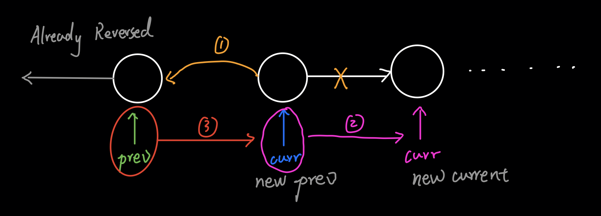

# [Leetcode 206. Reverse Linked List](https://leecode.com/problems/reverse-linked-list/)

## 题目

Reverse a singly linked list.

**Example:**
```
Input: 1->2->3->4->5->NULL
Output: 5->4->3->2->1->NULL
```

## 思路

链表题最直观的方法大多源于画图。我们可以先将翻转整个链表拆分为连续翻转每两个节点，如下图所示：

假设在`prev`之前我们已经完成了链表翻转。那么，我们第一步（黄色部分）先将当前`curr.next`指向`prev`，
这样就调换了`curr`与`prev`的顺序。第二步（粉色部分），我们需要将`curr`移动到下一个位置。这时我们发现
`curr.next`已经被改动了，所以在实际写代码的时候我们需要另外一个`next`，在我们第一步修改`curr.next`
之前保存记录下一个位置的值。第三步（红色部分），我们将`prev`也移动到下一个位置，即为`curr`的位置。

这样，我们就完成了局部链表的翻转。我们可以用循环的方式，重复这个过程，直至整个链表被翻转完成。
需要注意的是，循环的终止条件为当前节点为最后一个节点，即`curr.next`为`null`。那么我们终止循环之后，
我们仍然需要将`curr.next`正确设置，否则之前翻转好的链表就已经丢失了。不过，我们可以调整终止条件为
`prev`为最后一个节点，这时`curr`为`null`，我们可以直接返回`prev`。

## 解答
```java
/**
 * Definition for singly-linked list.
 * public class ListNode {
 *     int val;
 *     ListNode next;
 *     ListNode(int x) { val = x; }
 * }
 */
class Solution {
    public ListNode reverseList(ListNode head) {
        if (head == null || head.next == null) 
            return head;
        
        ListNode prev = null;
        ListNode curr = head;
        
        while (curr.next != null) {
            ListNode next = curr.next;
            curr.next = prev;   // Step1: Reverse link
            prev = curr;        // Step2: Proceed prev 
            curr = next;        // Step 3: Proceed curr
        }
        
        curr.next = prev;
        
        return curr;
    }
}
```

## Complexity Analysis
- **Time Complexity:** O(n). 我们遍历了整个链表来实现了翻转。
- **Space Complexity:** O(1). 我们直接在原来链表上进行操作，并没有使用额外的空间。

## 拓展

我们可以用递归的方式实现翻转吗？递归的时间空间复杂度又是多少呢？其实递归与循环对于每对节点的操作
是一样的。唯一不同在于，循环是从前到后翻转，递归则需要从后往前进行，并且我们需要记录保存最终翻转
后链表的`head`。代码如下：

```java
class Solution {
    public ListNode reverseList(ListNode head) {
        if (head == null || head.next == null) return head;
        ListNode globalHead = reverseList(head.next);
        head.next.next = head;
        head.next = null;
        return globalHead;
    }
}
```

## 总结

链表题一定要画图理解节点之间的连线，以及如何修改这些连线。同时我们可以尝试将大问题拆分为局部的小问题，
再通过循环或者递归的思想完成全局解。