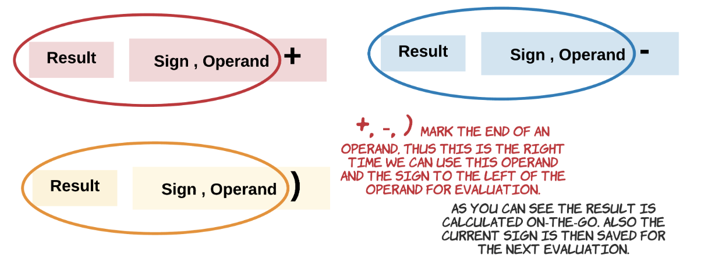

# [Leetcode 224. Basic Calculator](https://leetcode.com/problems/basic-calculator/)

## 题目

Implement a basic calculator to evaluate a simple expression string. 

The expression string may contain open `(` and closing parentheses `)`, the plus `+` or minus sign `-`, **non-negative** integers and empty spaces.

**Example 1:**
```
Input: "1 + 1"
Output: 2
```
**Example 2:**
```
Input: " 2-1 + 2 "
Output: 3
```
**Example 3:**
```
Input: "(1+(4+5+2)-3)+(6+8)"
Output: 23
```
**Note:**
- You may assume that given expression is always valid.
- **Do not** use the `eval` built-in library function.

## 思路

首先，我们可以先从最基础的两个数相加相减开始思考。

比如我们`input string`为`123 - 234`, 我们首先需要做的是从`string`中识别出`123`和`234`两个`operand`。我们知道数字为连续的`digit characters`，因此，我们可以循环地从左到右将`123`拆成`100 + 20 + 3`，或`234`拆成`200 + 30 + 4`即可得`operand`。另外，我们需要意识到加法和减法本质上是一样的，`123 - 234 = 123 + (-234)`。因此如果我们可以利用一个`sign`为1或-1来表示加减，即`operand1 + (sign) * operand2`.

然后，我们再从两个数的加减变为多个数的加减（没有括号的情况）。

比如我们的`input string`为`12 + 23 - 34`。按照我们之前的思路，可得`0 + sign1 * operand1 + sign2 * operand2 + sign3 * operand`。其中`operand1,2,3`分别为12, 23, 34, `sign1，2，3`分别为+1, +1, -1. 我们注意到当数变多之后，我们需要记录的`sign`和`operand`也越来越多，非常不方便。因此，我们可以在从左到右读`input string`的时候，同时进行计算，并将结果储存于`result`中，即`12 + 23`直接变为`35`这个`result`，然后整个式子变成了`35 + (- 34)`，即`result += operand * sign`。

最后，我们再考虑有括号的情况。当我们遇见左括号时，说明我们需要保存当前的`result`和`sign`，再重新开启一轮新的括号内的运算；当我们遇见右括号时，我们应该首先计算出括号内结果`bracketResult`，然后将之前保存的`result`更新为`result += sign * bracketResult`。

比如`1 + 1 - (2 - 5)`，我们在走完`1 + 1`之后得到`result = 2`，和括号前的`sign = -1`，我们可以先将他们保存至`stack`，然后重置`result, sign`，以重新开始括号内运算。当见到`)`时，我们首先将括号内的运算完成，即`bracketResult = 2 - 5 = -3`，然后再将`bracketResult`和之前保存至`stack`的数和相加或相减。

下图可以让大家更直观的理解这个过程：



## 解答

大家也可结合解答代码中每种情况的注释来理解我们的算法。
```java
class Solution {
    public int calculate(String s) {
        
        Stack<Integer> stack = new Stack<Integer>();
        int result = 0;
        int operand = 0;
        int sign = 1;
        
        for (char ch : s.toCharArray()) {
            
            // Covert digits to number (e.g. operand = 12, string = "123" -> 12 * 10 + 3)
            if (Character.isDigit(ch)) {
                operand = operand * 10 + (int) Character.getNumericValue(ch);
                continue;
            }
            
            switch (ch) {
                case '+': { // evaluate result, sign, operand
                    result += sign * operand;
                    sign = 1;
                    operand = 0;
                    break;
                }
                case '-': { // evaulate result, sign, operand
                    result += sign * operand;
                    sign = -1;
                    operand = 0;
                    break;
                }
                case '(': { // stack: [result, sign], reset temp result/sign to calculate
                    stack.push(result);
                    stack.push(sign);
                    result = 0;
                    sign = 1;
                    break;
                }
                case ')': { // evaluate bracketResult, sign, operand; evaluate stack [result, sign] + bracketResult.
                    result += sign * operand;
                    result *= stack.pop();
                    result += stack.pop();
                    operand = 0;
                }
            }
        }
        return result + (sign * operand);
    }
}
```

## Complexity Analysis

- **Time Complexity:** O(n). 我们需要遍历String中的所有字母。

- **Space Complexity:** O(n). Stack中最多可能装String中的所有数字。

## 拓展

如果不使用`sign`来负责加减，我们还能有其他什么办法解决这个问题呢？

## 总结

这类题型要求我们非常细致对问题进行分情况讨论，且不错过各种细节。一种比较好的思路即为从最简单版的问题想起（比如两个数相加），再逐渐扩充、修改，以满足题目要求。