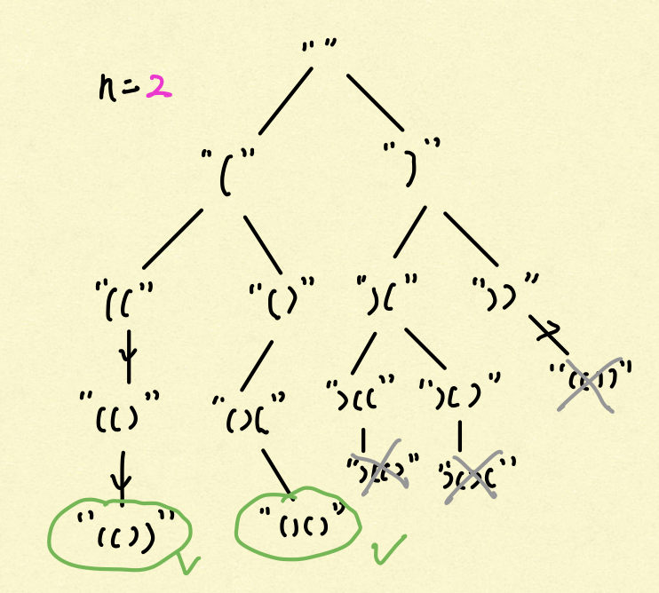
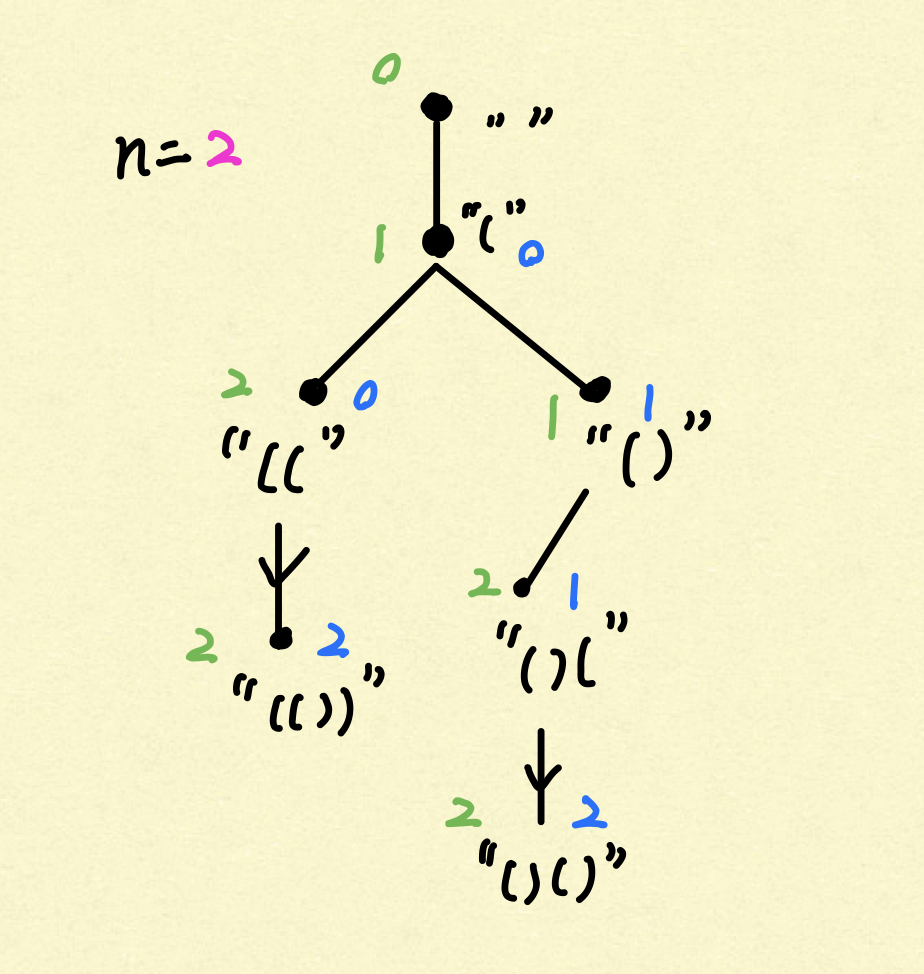

# [Leetcode 22. Generate Parentheses](https://leetcode.com/problems/generate-parentheses/)

## 题目

Given *n* pairs of parentheses, write a function to generate all combinations of
well-formed parentheses.

For example, given *n* = 3, a solution set is:
```
[
  "((()))",
  "(()())",
  "(())()",
  "()(())",
  "()()()"
]
```

## 思路

这道题初见感觉非常困难，排列组合非常多，不好梳理其中的逻辑和条理。我们不妨画图尝试观察其中的规律，
图中我们以`n=2`为例，将两个左括号、两个右括号排列如下：



根据上图我们可以建立一些直观感受，似乎可以把这道题目转化成图像，特别是树遍历的题目，来解决。最显而易见
的方法则为遍历上图中整个树的所有叶子节点（代表着这些括号的所有排列），再依次判断每个叶子节点是否为
valid. 当然，这样的方法未免太过粗暴，时间复杂度达到惊人的 O(2^n * n)，即`2^n`个括号排列，每个
排列又需要`n`的时间去检查是否valid.

我们可以再深入思考建树时的条件，以砍掉这个树上多余与不可能valid的情况，仅仅保留valid的路径。我们
注意到，只要左括号数量小于n，我们可以继续添加左边括号；只要右括号数量小于左边括号，我们可以添加
右括号。而在其他所有情况下，添加左或添加右括号都会让String不再valid. 根据以上的条件，我们可以把树
缩减为如下图所示：



这样，我们几乎砍掉了一半以上的路径，极大缩减了时间复杂度。而且，我们可以确保，根据以上条件建立出来的
叶子节点们就是我们要找的所有valid的组合。我们用backtrack的思想将以上的过程转换成代码，如下。

## 解答
```java
class Solution {
    
    List<String> ans;
    
    public List<String> generateParenthesis(int n) {
        ans = new ArrayList<String>();
        backtrack("", 0, 0, n);
        return ans;
    }
    
    private void backtrack(String curr, int left, int right, int max) {
        
        if (curr.length() == max * 2) { // completed valid string
            ans.add(curr);
            return;
        }
        
        if (left > right) {  // can add more ')' to the string
            backtrack(curr + ')', left, right + 1, max);
        }
        
        if (left < max) { // can add more '(' to the string
            backtrack(curr + '(', left + 1, right, max);
        }
    }
} 
```

## Complexity Analysis:
- **Time Complexity:** 这道题目的时间复杂度计算相对复杂。这里提供一些简要的思想：
  - 我们时间复杂度取决于我们叶子节点的数量，即valid parentheses sequence的数量；
  - 我们总共有C(2n, n)种排列所有左右括号的方式，即从2n个位置中选出n个位置放左括号，剩下n个放右括号；
  - 所有排列中的`1 / n+1`个为valid，因为左括号必须在右括号左边，总共`n + 1`个位置我们可以平移；
  - 比如`n=2`时，总共有4选2总共6种sequence，其中只有 1 / (1+2)个即2个valid sequence；
  - 叶子节点数量为：O( 1/(n+1) * C(2n, n) ) ~ O (4^n / (n*sqrt(n)) ).
  - 对于每个叶子节点，我们需要n步，所以时间复杂度为 O (4^n / sqrt(n) ). 

- **Space Complexity:** 类似以上，空间复杂度为 O (4^n / sqrt(n) ). 

## 拓展

对于这道题目，我们还可以利用closure number的思想来解决。我们可以把所有valid的sequence看做为
几个disjoint set的集合。这个方法可能不太好理解，有兴趣的同学可以看[这里](https://leetcode.com/problems/generate-parentheses/solution/)

## 总结

这道题本质是一个图像题、Backtracking题。难点就在于我们能否将这样不直观的题目转化为直观的图像和
Backtracking问题。Once Again, practice makes perfect.

## Reference
- [BackToBack SWE Explanation](https://www.youtube.com/watch?v=sz1qaKt0KGQ)
- [Official Leetcode Solution](https://leetcode.com/problems/generate-parentheses/solution/)