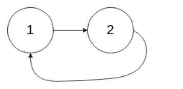
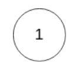
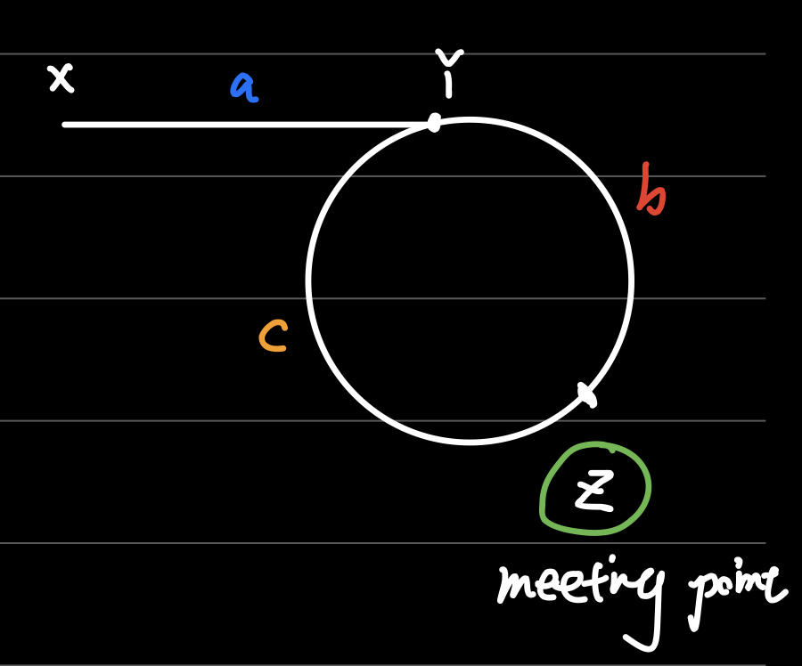

# [Leetcode 142. Linked List Cycle II](https://leetcode.com/problems/linked-list-cycle-ii/)

## 题目

Given a linked list, return the ndoe where the cycle begins. If there is no cycle, return null.

To represetn a cycle in the given linked list, we use an integer `pos` which represents the position (0-indexed) in the
linked list where tail connects to. If `pos` is `-1`, then tehre is no cycle in the linked list.

**Note:** Do not modify the linked list.

**Example 1:**
```
Input: head = [3,2,0,-4], pos = 1
Output: tail connects to node index 1
Explanation: There is a cycle in the linked list, where tail connects to the second node.
```


**Example 2:**
```
Input: head = [1,2], pos = 0
Output: tail connects to node index 0
Explanation: There is a cycle in the linked list, where tail connects to the first node.
```


**Example 3:**
```
Input: head = [1], pos = -1
Output: no cycle
Explanation: There is no cycle in the linked list.
```


## 思路

这道题目最直接的思路为使用`HashSet`，将所有见过的`node`往`set`中存储，如果遇见重复的，则一定有环；如果走到了`linked list`尽头，则无环。
值得注意的是，我们需要将整个`node object`存于`set`中，而不仅仅是`node.val`，因为我们需要判断前后遇见的是不是同一个**节点**。
```java
public class Solution {
    public ListNode detectCycle(ListNode head) {
        HashSet<ListNode> set = new HashSet<ListNode>();
        while (head != null) {
            if (set.contains(head)) return head;
            set.add(head);
            head = head.next;
        }
        return null;
    }
}
```

这道题还可以用双指针来解答。大家可以停下来，按照这个思路自己去思考该怎么解决。

如果你花了很多个小时尝试了多种双指针且百思不得其解（像编者一样），没有关系，这个算法并不是大多数人轻易能想出来的。
这道题目双指针的解法被称为`Floyd Cycle Detection Algorithm`，它由图灵奖得主、UIUC/CMU/斯坦福大学教授`Robert Floyd`在1967年的论文中提出。
大部分网上解答都使用这个算法，但他们大多解释得不太清楚，不易理解。我们在这里尽量简明的解释这个算法的思想。

我们将题目直观表示为下图。a表示链表中无环的部分，Y节点是我们要返回的节点（圆环开始节点）。`Floyd`龟兔赛跑算法创立两个指针`slow`和`fast`，
从X位置开始，`fast`以`slow`的**两倍**速度遍历链表。

以下两间事情必然会发生：
1. `fast`和`slow`都会进入圆环
2. `fast`和`slow`最终会在圆环上的某一节点Z相遇。



第一件事很直观，从X开始的`slow`和`fast`无论如何都会经过Y进入环。第二件事就很不好理解了。在圆环上两个速度不一的指针为何最终会相遇？这可以用数学方法证明，
详见[这里](https://leetcode.com/problems/linked-list-cycle-ii/solution/). 当然，我们可以更直观的这样理解：
在操场上，你（`slow`）和博尔特（`fast`）赛跑。博尔特的速度刚好是你的两倍。如果你们从同一起点出发，你跑完一圈之后博尔特刚好跑完两圈，你们会在起点再次相遇；
如果你在博尔特前面的位置出发，博尔特肯定能在你跑完一圈之内追上你；如果你在博尔特之后的位置出发，博尔特也一定能反超并追上你。因此，我们`fast`和`slow`指针
在圆环上必定相遇。

在确信以上两件事情之后，我们可以发现，从开始到两者相遇为止，`slow`走过X->Y->Z，距离为`a + b`；`fast`走过X->Y->Z->Y->Z，距离为`a + b + c + b`.
同时，我们知道`fast`走的距离一定为`slow`的两倍（相同时间，两倍的速度）。因此我们可以知道：
```
2 * (a + b) = a + b + c + b
          a = c
```
知道`a = c`且能够找到节点Z，我们可以很自然地再次用两个同样速度节点，一个从X开始，一个从Z开始，相向走相同距离，以找到节点Y的位置。问题就这样被巧妙的解决了。

## 解答
```java
public class Solution {
    public ListNode detectCycle(ListNode head) {
        
        ListNode meetPoint = meetingPoint(head);
        
        // acyclic
        if (meetPoint == null) 
            return meetPoint; 
        
        // same speed, opposite direction -> same distance
        ListNode front = head;
        ListNode end = meetPoint;     
        while (front != end) { 
            front = front.next;
            end = end.next;
        }
        return front;
    }

    /**
     * This finds the meeting point Z
     */
    private ListNode meetingPoint(ListNode head) {
        ListNode slow = head;
        ListNode fast = head;
        while (fast != null && fast.next != null) {
            fast = fast.next.next;
            slow = slow.next;
            if (slow == fast) {
                return fast;
            }
        }
        return null;
    }
}
```

## Complexity Analysis

- **Time Complexity:** O(n). 对于找MeetingPoint这个过程，在无环的情况下，`fast`指针最多遍历整个链表；在有环情况下，`fast`必然在`slow`跑完有限圈内追上`slow`。对于最后找Y的过程，遍历节点数必然小于等于所有节点数。

- **Space Complexity** O(1). 我们没有使用额外的空间。

## 拓展

请用数学的方式证明这个算法有效。主要证明两个问题：一是`fast`和`slow`为什么必然能在圆环上相遇，二是他们相遇的时间为什么是O(n).

## 总结

平时，我们需尽可能地了解各种存在于世的优质算法，深刻理解它们。在真正面试的时候，建议还是从第一种最好思考的解法开始，而不要一开始就追求最”巧妙“的解答。如果要得出`Floyd`算法，需要有大量算法知识的储备和积累，才能临场发挥找到这种解答。

## Reference

- [Floyd's algorithm, StackExchange](https://cs.stackexchange.com/questions/10360/floyds-cycle-detection-algorithm-determining-the-starting-point-of-cycle)
- [wall0p's solution](https://leetcode.com/problems/linked-list-cycle-ii/discuss/44793/O(n)-solution-by-using-two-pointers-without-change-anything)
- [Floyd Cycle Detection, Wikipedia](https://en.wikipedia.org/wiki/Cycle_detection)
- [Robert W. Floyd, Wikipedia](https://en.wikipedia.org/wiki/Robert_W._Floyd)