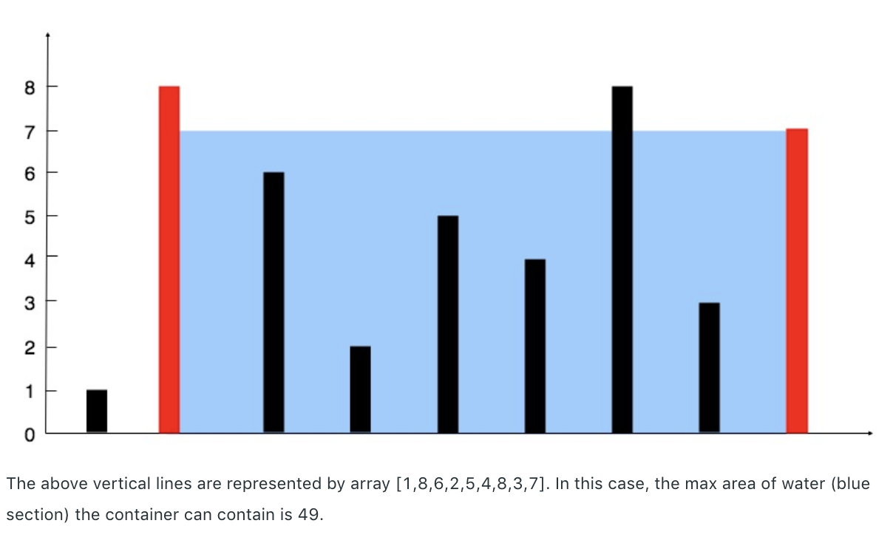

# [Leetcode 11. Container With Most Water](https://leetcode.com/problems/container-with-most-water/)

## 题目

Given *n* non-negative integers a1, a2, ..., an, where each represents a point at coordinate (i, ai). n vertical lines are drawn such that the two endpoints of line *i* at (i, ai) and (i, 0). Find two lines, which together with x-axis forms a container, such that container contains the most water. 

**Note:** You may not slant the container and *n* is at least 2. 



**Example:**
```
Input: [1, 8, 6, 2, 5, 4, 8, 3, 7]
Output: 49
```

## 思路

这道题需要考虑两个要素：两个木板（线段）的高度与他们相间隔的距离。最短的木板越高、两个木板相间隔的越远，能装的水就越多。
因此，本质上我们需要在长度和高度之间做一些相应的选择。

如何才能刚好能找到能装水最多的两块木板呢？为了避免盲目的寻找，我们可以先思考两个相对较优的方案：间距最大与高度最高。
鉴于数组并不能直接得出最大值，我们可以先从长度最大的情况开始考虑。这时我们`left`和`right`两块木板分别是
`height`中第一块与最后一块木板，长度为`height.length - 1`，容积则为间隔长度与`min(height[left], height[right])`的乘积。
因为这已经是长度最大的情况，无论我们怎样移动木板，长度都会减少。因此，为了找到最大的容量，我们只能看能不能通过移动更短的木板、
获取更高高度来弥补长度上的损失。如果移动木板后，容积增加，则更新当前的最大容积；否则，继续移动更短木板以求获得更高的高度。

为什么这样能找到容积最大的两块木板呢？在长度最大的情况下的容积，已经是左右木板中较短那个木板所能获得的最大容积。这时，我们可以
直接丢弃这个较短木板，将指针移向下一个木板来找更大的全局最优容量。依次类推，对每个木板，我们都已经找到了他们所能得到的最大容量，
所以，我们最终能够找到全局最优的解答。[这里](https://leetcode.com/problems/container-with-most-water/discuss/6099/Yet-another-way-to-see-what-happens-in-the-O(n)-algorithm)还有另一种证明方式。

## 解答
```java
public class Solution {
    public int maxArea(int[] height) {
        int left = 0;
        int right = height.length - 1;
        int globalMax = 0;
        while (left < right) {
            int currMax = Math.min(height[left], heigth[right]) * (right - left);
            if (currMax > globalMax) globalMax = currMax;
            if (height[left] < height[right]) left++;
            else right++;
        }
        return maxArea;
    }
}
```

## Complexity Analysis

- **Time Complexity:** O(n). 在双指针扫描过了整个数组。
- **Space Complexity:** O(1). 我们在扫描过程中并没有创建新的空间来存储中间数据。

## 总结

这道题目中有两个变量，求这两个变量的乘积最大值。难点在于两个变量如果同时不可控地变化，我们寻找最大乘积的过程就会变得盲目。

因此，核心的解题思想，则应该是控制其中一个变量的变化方向（比如让长度从最大值开始递减），再寻找另一个变量的最优解
（比如通过移动较短木板来更新高度）。这类题目也是双指针的经典应用：我们需要思考指针的移动方式和比较规则。
