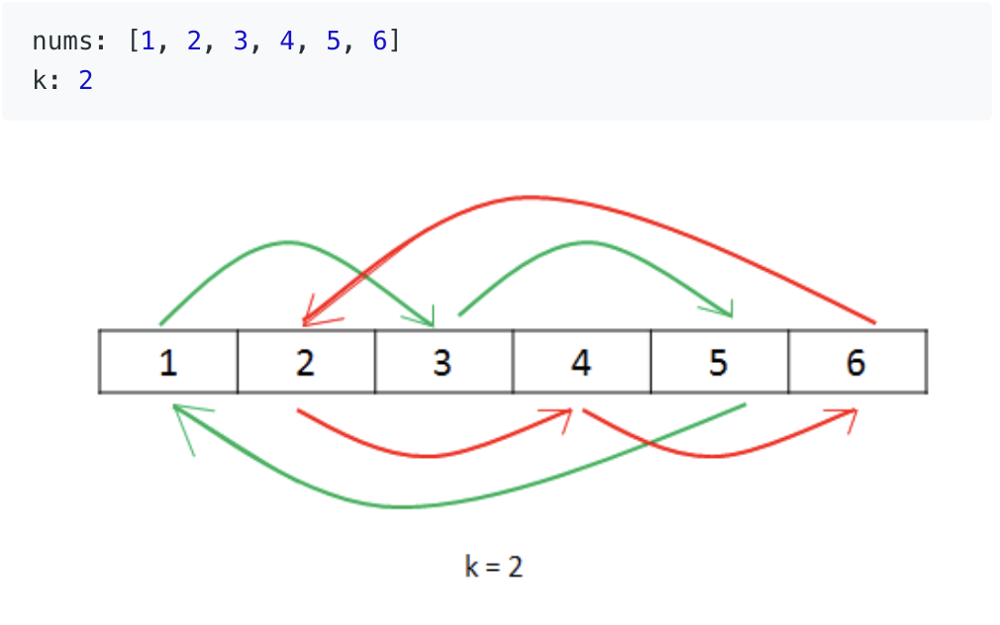

# [Leetcode 189. Rotate Array](https://leetcode.com/problems/rotate-array/)

## 题目

Given an array, rotate the array to the right by *k* steps, where *k* is non-negative.

**Example 1:**
```
Input: [1, 2, 3, 4, 5, 6, 7] and k = 3
Output: [5, 6, 7, 1, 2, 3, 4]
Explanation:
rotate 1 step to the right: [7, 1, 2, 3, 4, 5, 6]
rotate 2 steps to the right: [6,7,1,2,3,4,5]
rotate 3 steps to the right: [5,6,7,1,2,3,4]
```
**Example 2:**
```
Input: [-1,-100,3,99] and k = 2
Output: [3,99,-1,-100]
Explanation: 
rotate 1 steps to the right: [99,-1,-100,3]
rotate 2 steps to the right: [3,99,-1,-100]
```
**Note:**
- Try to come up as many solutions as you can
- Could you do it in-place with O(1) extra space

## 方案一：

### 思路
这道题有很多种不同的解法。最直接的一种为创建一个新的空数组，然后对于原来数组中每个数，计算出其旋转
之后的新index，并按照新的index将数放入新的数组中。不过，这样需要用额外O(n)的空间来储存新的数组，
因为如果我们直接将数放入原有数组中新的index，那么该位置的原有的元素则会丢失，造成错误。

### 解答
```java
public class Solution {
    public void rotate(int[] nums, int k) {
        int[] rotated = new int[nums.length];
        for (int i = 0; i < nums.length; i++) {
            rotated[(i + k) % nums.length] = nums[i]; // compute new index
        }

        // place rotated result back to nums
        for (int i = 0; i < nums.lenght; i++) {
            nums[i] = rotated[i];
        }
    }
}
```
### Complexity Analysis:
- **Time Complexity:** O(n)
- **Space Complexity:** O(n)


## 方案二：

### 思路
为了不使用额外的空间，我们可以思考如何在旋转数组的过程中，一方面正确放置单个元素至新位置，
另一方面保证这个新位置的老东家不被覆盖。我们可以尝试一种类似于游击找房的策略：我们从位置0的元素A开始
发现A旋转后的新index为位置k，那么我们将A直接放置到位置k，并把位置k原有的元素B拿出来，继续给B找
其新的index为位置m，将B放到m，再把m位置的C拿出来... 以此类推。这样我们通过特殊的放置顺序避免了
使用额外的空间，如果我们将这个过程进行n次，那么我们就可以完成数组的旋转。



### 解答
```java
public class Solution {
    public void rotate(int[] nums, int k) {
        k = k % nums.length;
        int count = 0;
        for (int start = 0; count < nums.length; start++) {
            int current = start;
            int prev = nums[start];
            do {
                int next = (current + k) % nums.length;
                int temp = nums[next];
                nums[next] = prev;
                prev = temp;
                current = next;
                count++;
            } while (start != current);
        }
    }
}
```
### Complexity Analysis:
- **Time Complexity:** O(n)
- **Space Complexity:** O(1)

## 方案三：

### 思路
一种更巧妙的方法则需要我们仔细观察旋转前后的数组区别。举例如下，假设我们n=7, k=3：
```
Original List                   : 1 2 3 4 5 6 7
After rotating k positions      : 5 6 7 1 2 3 4
```
我们发现一个有趣（= =)的现象：旋转后数组的**前**k个元素为老数组的**最后**k个元素，新数组的**后面**(n-k)个
元素为老数组**前**(n-k)个元素。那有什么办法能够直接交换n和(n-k)两组元素吗？我们可以试图先翻转整个数组，如下
```
Original List                   : 1 2 3 4 5 6 7
After reversing all numbers     : 7 6 5 4 3 2 1
```
这时候我们会注意到，如果我们再分别翻转前n个元素，以及后(n-k)个元素，我们就能得到想要的结果，如下：
```
Original List                   : 1 2 3 4 5 6 7
After reversing all numbers     : 7 6 5 4 3 2 1
After reversing first k numbers : 5 6 7 4 3 2 1
After revering last n-k numbers : 5 6 7 1 2 3 4 --> Result
```
### 解答
```java
public class Solution {
    public void rotate(int[] nums, int k) {
        k %= nums.length;
        reverse(nums, 0, nums.length - 1);
        reverse(nums, 0, k - 1);
        reverse(nums, k, nums.length - 1);
    }
    public void reverse(int[] nums, int start, int end) {
        while (start < end) {
            int temp = nums[start];
            nums[start] = nums[end];
            nums[end] = temp;
            start++;
            end--;
        }
    }
}
```
### Complexity Analysis
- **Time Complexity:** O(n)
- **Space Complexity:** O(1)

## Reference
[Leetcode Official Solution](https://leetcode.com/problems/rotate-array/solution/)
