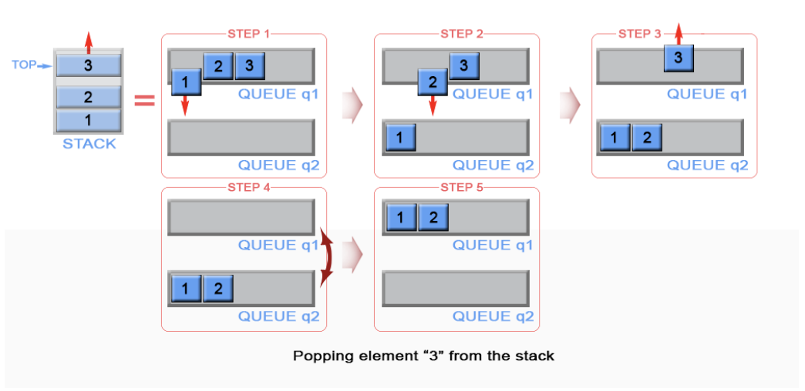
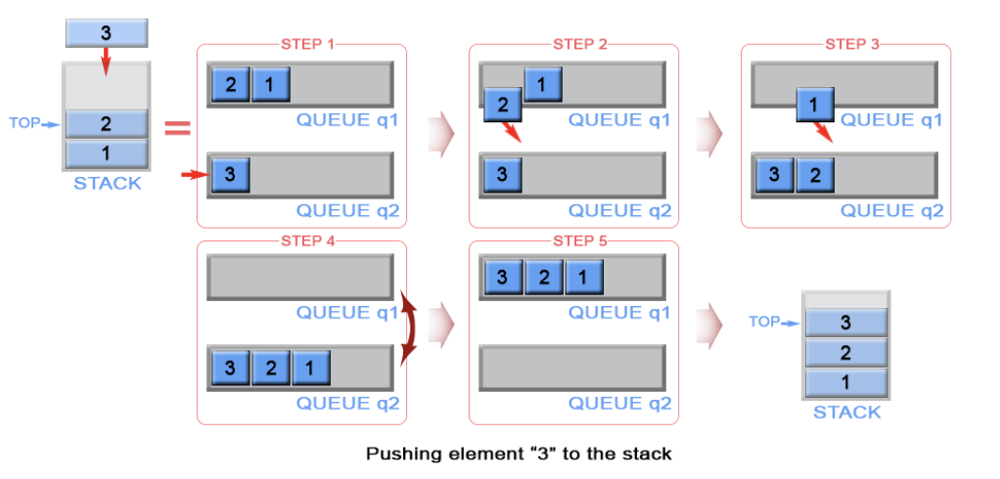
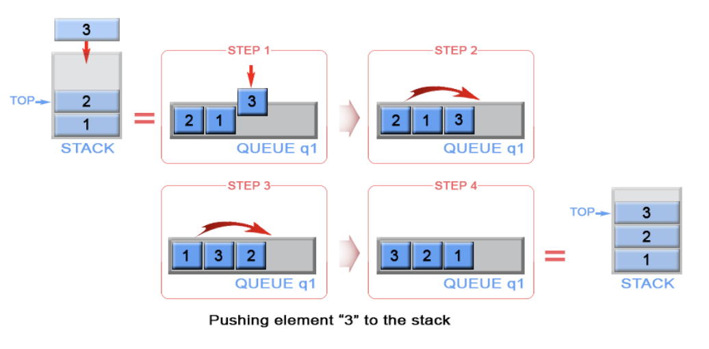

# [Leetcode 225. Implement Stack Using Queues](https://leetcode.com/problems/implement-stack-using-queues/)

## 题目

Implement the following operations of a stack using queues. 
- push(x) -- Push element x onto stack
- pop() -- Remoeves the element on top of the stack
- top() -- Get the top element
- empty() -- Return whether the stack is empty

**Example:**
```
MyStack stack = new MyStack();

stack.push(1);
stack.push(2);  
stack.top();   // returns 2
stack.pop();   // returns 2
stack.empty(); // returns false
```
**Notes:**
- You must use *only* standar operations of a queue -- which means only `push to back`, `peek/pop from front`, `size`, and `is empty` operations are valid
- Depending on your language, queue may not be supported natively. You may simulate a queue by using a list or deque (doubled-ended queue), as long as you use only standard operations of a queue.
- You may assume that all operations are valid (for example, no pop or top operations will be called on an empty stack)

## 思路

Stack为FILO，Queue为FIFO。我们应该怎样巧妙地使用FIFO的数据结构来实现FILO呢？我们会发现Stack和
Queue最本质的区别在于放入或取出元素顺序恰好相反。因此，这道题目主要考点为我们怎样将Queue的顺序调换
以实现出Stack的效果。

MyStack作为一个FILO的Stack，我们在每次Pop的时候，需要取到最晚被push进的元素，它也就是为内部Queue的最后一个
元素。基于此，我们可以有一个最直接的想法：在pop的时候，我们把内部Queue的前面size - 1个元素全部
pop from front，再return pop的最后一个元素即可。同时，为了保证数据不丢失，我们需要另一个临时的Queue来
储存前面size - 1个元素。图示如下：



因为这一种方法的MyStack沿用了内部Queue本身的push，所以push时间复杂度为**O(1)**, 但是在每次
pop的时候需要重新通过的Queue排列所有的元素，所以pop的时间复杂度为**O(n)**.

如果我们不想每次pop都花费O(n)的时间呢？这时候，我们就需要做一些权衡和取舍。除了在pop的时候我们
可以调换Queue的顺序，我们其实也可以在push时候就用类似的方法调换顺序，这样pop的时间复杂度就能被
降低到**O(1)**，同时push的时间复杂度增加到了**O(n)**。图示如下：



具体是在Push还是Pop的时候调换顺序，取决于实际的应用逻辑。在Push较多而Pop较少的场景下，我们应该
使用第一种方法，在Push较少而Pop较多的场景下则使用第二种。当然，实际上少有人会强行使用Queue去实现
Stack，这大概是自己找罪受...

我们同样注意到以上两种方法都使用了两个Queue，导致使用额外**O(n)**的空间。我们可以在第二种方法的基础上
继续优化：在调换顺序的时候，我们将Queue前size - 1个元素拿出来之后，并不放进新的临时Queue，而是
直接放回原Queue末尾。图示如下：



最终，我们可以得到如下的解答：

## 解答
```java
class MyStack {

    private Queue<Integer> queue;
        
    /** Initialize your data structure here. */
    public MyStack() {
        queue = new LinkedList<Integer>();
    }
    
    /** Push element x onto stack. */
    public void push(int x) {
        // Reverse the order of queue when pushing
        queue.add(x);
        for (int i = queue.size(); i > 1; i--) {
            Integer k = queue.remove();
            queue.add(k);
        }
    }
    
    /** Removes the element on top of the stack and returns that element. */
    public int pop() {
        return queue.remove();
    }
    
    /** Get the top element. */
    public int top() {
        return queue.peek();
    }
    
    /** Returns whether the stack is empty. */
    public boolean empty() {
        return queue.isEmpty();
    }
}
```

## Complexity Analysis
- **Time Complexity**: Push - O(n), Pop/Peek/isEmpty - O(1)
- **Space Complexity**: O(1). 在调换顺序的时候，我们不再使用额外的空间，而直接利用原来的Queue。 

## 总结
- 数据结构设计题，我们首先要抓住需要解决的核心问题。比如这道题的核心问题为如何调换Queue的顺序以
  模拟出Stack的效果。然后再寻求不同的解决方案并优化。
- 往往这类设计题型都有不同的解决方案，我们需要根据实际应用情况（/面试官）的要求来做出权衡与取舍。
  比如，是将Push设计得用时更久，还是将Pop设计得用时更久。

## Reference

[Leetcode Official Solution](https://leetcode.com/problems/implement-stack-using-queues/solution/)