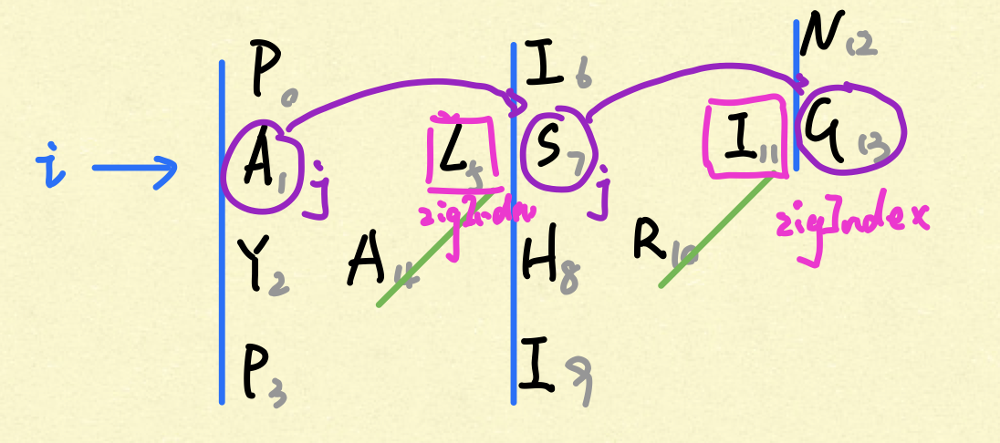
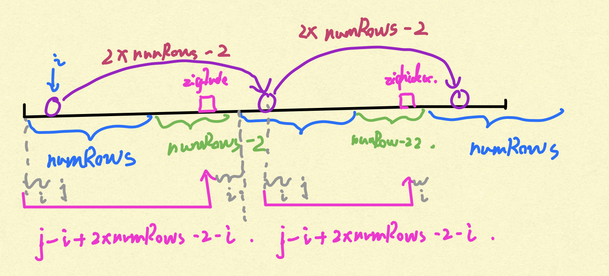

# [Leetcode 6. ZigZag Conversion](https://leetcode.com/problems/zigzag-conversion/)

## Question

The string `"PAYPALISHIRING"` is written in a zigzag pattern on a given number of rows like this: (you may want to display this pattern in a fixed font for better legibility)

```
P   A   H   N
A P L S I I G
Y   I   R
```
And then read line by line: `"PANHAPLSIIGYIR"`

Write the code that will take a string and make this conversion given a number of rows:
```
string convert(string s, int numRows);
```
**Example 1:**
```
Input: s = "PAYPALISHIRING", numRows = 3
Output: "PAHNAPLSIIGYIR"
```
**Example 2:**
```
Input: s = "PAYPALISHIRING", numRows = 4
Output: "PINALSIGYAHRPI"
Explanation:

P     I    N
A   L S  I G
Y A   H R
P     I
```

## Thoughts

One straight forward idea to construct the result String is to jump to appropriate positions (characters) of the input string and take corresponding characters. For instance, in above example 2, we need to pick P, I, N first, then A, L, S, I, G, and so on. Let's draw a colored zig-zag pattern so that we can think about the process more clearly.



Here every blue line is a column and those upper-right-pointing green lines connect them. To construct the result string following row order, we iterate through every row and for each row we need to make the *j* pointer jump from column to column. Additionally, while *j* jumps between columns, we need to make it pick characters at the *zigIndex* (the characters on the green lines). 

In order to achieve this, we need to calculate the indices very carefully. Let's flat the zig-zag pattern onto original input string as following.



We know that every blue line has equal length and so do gree lines. We also know that every green line must follow a blue line. Thus, if we start from blue line's leftmost position, we can get to next blue & green segment by  adding their length. If *j* is some point on the blue line and it wants to jump to corresponding point on the *next* blue line, its jumping distance should be the sum of blue and green lines' length:
```
increment of j = numRows + numRows - 2 = 2 * numRows - 2
``` 

Once we have the *j* index, the trickiest part is figuring out the *zigIndex* (index of characters on the green line). Remember that the green lines start from bottom to top, while the characters should be picked from top to bottom by row order. Therefore, while we iterate by row order, we should start from each of green line's rightmost positions and then decrement by the row number *i*. Once we have the *j* index, we can simple get the blue line's leftmost position by `j - i` and then add blue & green lines' length to get green lines' right most position. In summary, the zig-zig index given *j* is formulated as following:
```
zigIndex = j - i + 2 * numRows - 2 - i
```

Finally, we should use nested for loops, consider severel edge cases (e.g. s.length() > numRows, index out of bondary), and arrive at the solution below.

## Solution
```java
class Solution {
    public String convert(String s, int numRows) {
        
        if (s == null || s.length() <= numRows || numRows == 1) return s;
        
        StringBuilder res = new StringBuilder();
        
        for (int i = 0; i < numRows; i++) {
            
            // construct string for row i by jumping to corresponding positions
            for (int j = i; j < s.length(); j += numRows * 2 - 2) {
                res.append(s.charAt(j));
                int zigIndex = j - i + 2 * numRows - 2 - i;
                if (i > 0 && i < numRows - 1 && zigIndex < s.length()) 
                    res.append(s.charAt(zigIndex));
            }
            
        }
        return res.toString();
    }
}
```

## Complexity Analysis

- **Time Complexity:** O(n). We iterate through every character in the input string once and only once. 

- **Space Complexity:** O(n). We only use one extra StringBuilder to store the resulting string. 

## Extension

Here we use StringBuilder to construct the resulting string which leads to O(n) space complexity. Can you do it in O(1)?

## Summary

The challenging part of this type of question is to be careful enough to calculate indices. To arrive at correct solution without indexOutOfBound errors or missing testcases, we have to think thorougly, draw out pictures, and try out trial cases. 

## Reference

- [Mao](https://www.li-mao.net)'s original series. 