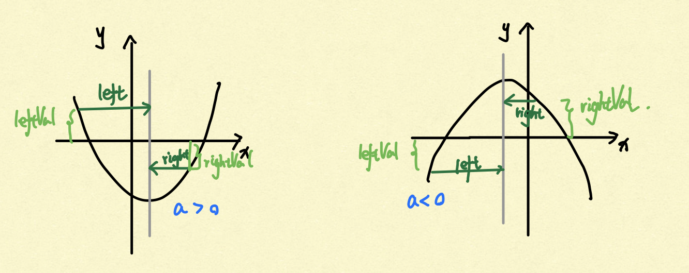

# [Leetcode 360. Sort Transformed Array](https://leetcode.com/problems/sort-transformed-array/)

## 题目

Given a **sorted** array of integers *nums* and integer values a, b and c. Apply a quadratic functionof the form f(x) = ax^2 + bx + c to each element x in the array.

The returned array must be in **sorted array**.

Expected time complexity: **O(n)**

**Example 1:**
```
Input: nums = [-4,-2,2,4], a = 1, b = 3, c = 5
Output: [3,9,15,33]
```
**Example 2:**
```
Input: nums = [-4,-2,2,4], a = -1, b = 3, c = 5
Output: [-23,-5,1,7]
```

## 思路

这道题本质上是一道数学题。既然题目要求时间复杂度为O(n)，那么我们必不能把所有数根据公式算出来再进行排序，花费O(nlog(n))的时间。我们首先回忆一元二次方程ax^2 + bx + c的特性：



当a > 0，图形开口向上，从两头往中间y值逐渐变小；当a < 0，图形开口向下，从两头想中间y值逐渐变大。结合题目，input nums是已经排好序的。如果我们使用双指针从两头往中间计算元素经过方程后的值，在a > 0的情况下，这些值为递减的；在a < 0的情况下这些值为递增的。因此，为了使最终的结果排序，我们可以a > 0和a < 0分情况处理，使结果一直为递增排序的。

值得注意的是，在这个过程中，我们需要依据左右指针元素经过计算后值的大小，来决定具体讲哪个值放入结果中。

## 解答
```java
class Solution {
    public int[] sortTransformedArray(int[] nums, int a, int b, int c) {
        
        int len = nums.length;
        int[] res = new int[len];
        if (len == 0) return res;
        
        // Two pointers scan from two ends towards middle
        int left = 0, right = len - 1;
        int index = a > 0 ? len - 1 : 0;
        while (left <= right) {
            boolean leftLarger = eval(nums[left], a, b, c) >= eval(nums[right], a, b, c);
            if (a > 0) { // starting from end, put larger one
                res[index--] = leftLarger ? eval(nums[left++], a, b, c) : eval(nums[right--], a, b, c);
            }
            else { // starting from front, put smaller one
                res[index++] = leftLarger ? eval(nums[right--], a, b, c) : eval(nums[left++], a, b, c);
            }
        }
        return res;
    }
    
    private int eval(int x, int a, int b, int c) {
        return a * x * x + b * x + c;
    }
}
```

## Complexity Analysis

- **Time Complexity:** O(n). 我们总共仅遍历所有元素一次，双指正从左右两端开始，中间汇合。

- **Space Complexity:** O(1). 除了返回的结果以外，我们没有使用额外的空间。

## 拓展

如果input方程一元四次，我们可以用类似的方法解决这个问题吗？要做出哪些改变？

## 总结

万物皆数学，我们对基本的初中数学概念要足够熟练，能够立马反应出不同方程的特性和图像。同时，我们要结合程序上的思想，比如这里的双指针，来进一步辅助我们解决问题。

## Reference

[xuyirui's solution](https://leetcode.com/problems/sort-transformed-array/discuss/83322/Java-O(n)-incredibly-short-yet-easy-to-understand-AC-solution)

