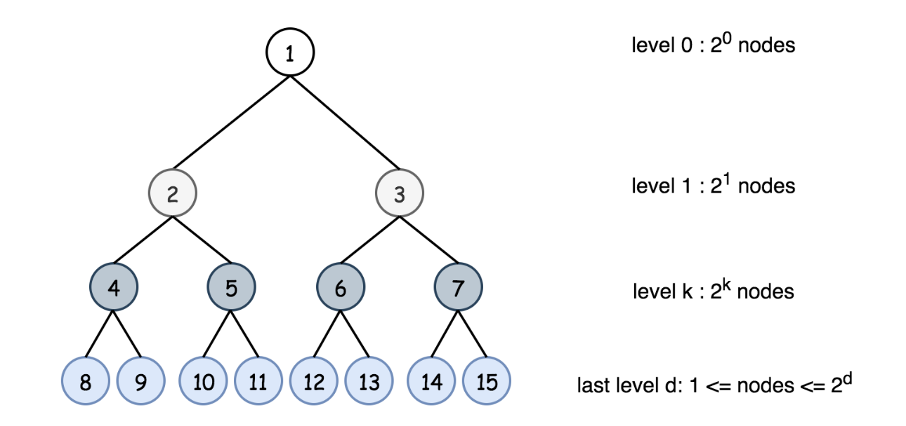
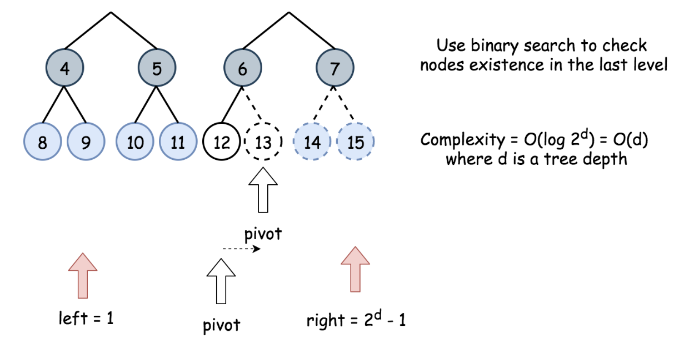
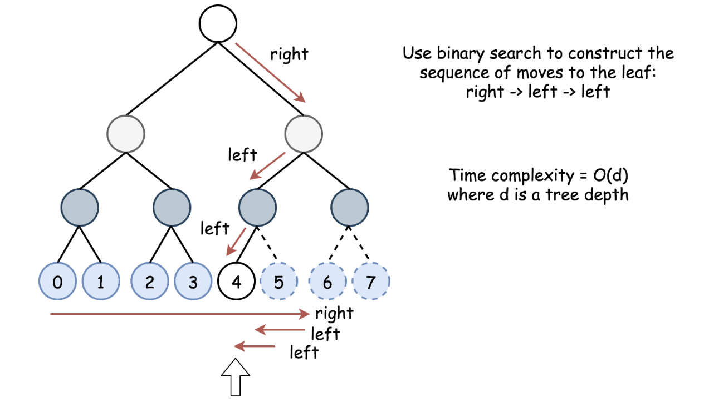

# [Leetcode 222. Count Complete Tree Nodes](https://leetcode.com/problems/count-complete-tree-nodes)

## 题目

Given a **complete** binary tree, count the number of nodes.

**Note:**
In a complete binary tree, every level except possibly the last, is completely
filled, and all nodes in last level are as far left as possible. It can have between 1 and
2h nodes inclusive at the last level h.

**Example:**
```
Input: 
    1
   / \
  2   3
 / \  /
4  5 6

Output: 6
```

## 思路

最简单直接的方法为用递归的方式，pre-order traverse整个二叉树。代码非常简单，如下
```java
 public int countNodes(TreeNode root) {
    if (root == null) return 0;
    else return 1 + countNodes(root.left) + countNodes(root.right);
}
```
这种解法时间复杂度为O(n), 空间复杂度为O(log(n))，因为递归需要使用至少树高的stack space。

我们显然可以运用题目给定的Complete Binary Tree这个条件来找到更好的解法。树的第k层(root高度为0)
拥有`2^k`个节点，从0到k层所有节点数量为`2^(k+1) - 1`. 



假设树的高度为h，从0到`h-1`层总共节点数量为一定为`2^h - 1`，最后一层节点数在1到`2^h`之间。因此,
要计算全部节点数量，我们只需计算出最后一层有多少个节点。

树的高度非常好计算，我们仅需从root一直往左走走到叶子节点就能得到高度。但是我们如何能很快的计算出
最后一层有多少个叶子节点呢？从本质上讲，我们是需要在最后一层的`2^h`个位置中，找到最靠右、并且不为
`null`的节点位置。冥冥中我们感受到了一种经典搜索算法的召唤：Binary Search！！

使用Binary Search，我们从左边第二个的节点位置1（因为最后一层必然至少有一个最左的节点）、最右
的节点位置2^h - 1开始，用二分法检查中点节点是否为`null`，以此调整`left`, `right`范围，最终
找到最靠右的非空节点。



不过，在知道中点节点的位置之后，我们怎么检查其是否为`null`呢？我们依旧可以使用Binary
Search! 我们使用二分法来重建树上的行进路线，以此来找到该中点节点。



总结来讲，我们利用Complete Binary Tree的特性，利用Binary Search来寻找最后一层最靠右的非空
节点，并基于节点位置来重建了其树上的路径，以此判断该节点是否存在。

## 解答
```java
/**
 * Definition for a binary tree node.
 * public class TreeNode {
 *     int val;
 *     TreeNode left;
 *     TreeNode right;
 *     TreeNode(int x) { val = x; }
 * }
 */
class Solution {
    public int countNodes(TreeNode root) {
        
        if (root == null) return 0;
        
        int h = treeHeight(root);
        
        int left = 1;
        int right = (int)Math.pow(2, h) - 1;
        
        // Binary search on last layer to see if exists
        while (left <= right) {
            int mid = left + (right - left) / 2;
            if (nodeExists(mid, root, h)) left = mid + 1;
            else right = mid - 1;
        }
        
        return left + (int)Math.pow(2, h) - 1;
        
    }
    
    // Computes the tree height
    private static int treeHeight(TreeNode root) {
        int height = 0;
        while (root.left != null) {
            root = root.left;
            height ++;
        }
        return height;
    }
    
    // Verifies if index node exits in tree
    private static boolean nodeExists(int index, TreeNode root, int height) {
        int left = 0;
        int right = (int)Math.pow(2, height) - 1;
        // go down the tree d times, 
        for (int i = 0; i < height; i++) {
            int mid = left + (right - left) / 2;
            // each time making corresponding move to reach index
            if (index <= mid) {
                root = root.left;
                right = mid;
            }
            else {
                root = root.right;
                left = mid + 1;
            }
        }
        return root != null;
    }
}
```

## Complexity Analysis

- **Time Complexity:** O(log(n)^2). 对最后一层的n个位置进行二分搜索需要O(log(n)), 每次
  搜索又需要O(log(n))的时间判断其是否存在。
- **Space Complexity** O(1). 与递归不同，我们不再需要Stack space，而是直接在树上遍历，所以
  我们并不需要额外的空间。

## 拓展

- 递归与二分搜索两种方法，在什么情况下选择前者？什么情况下选择后者？
- 还有更快的解法吗？

## 总结

首先，我们发现题目给的每一个条件都别有用心，我们都应该加以利用。其次，我们在完成”搜索“一类的任务时，
应该主动发现并考虑使用Binary Search，会有奇效。

## Reference

- [Leetcode Official Solution](https://leetcode.com/problems/count-complete-tree-nodes/solution/)